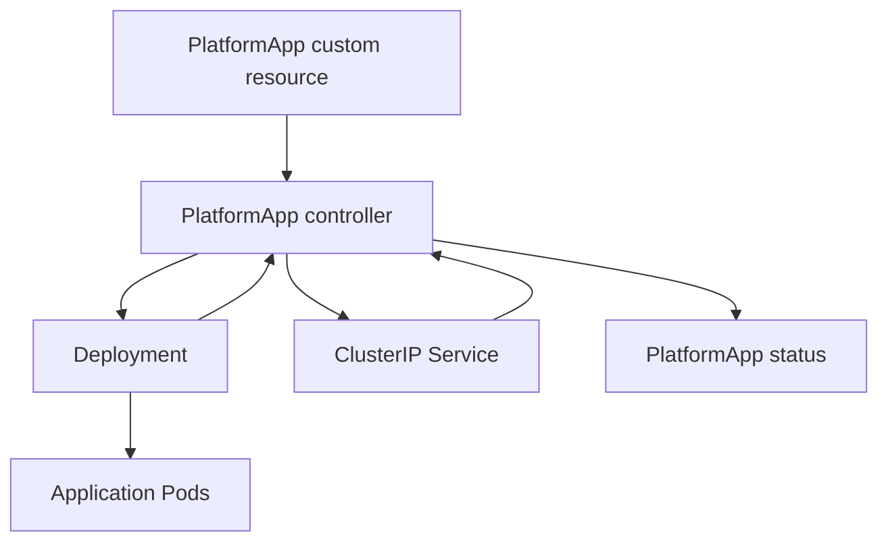

# PlatformApp Operator

PlatformApp Operator is a Kubernetes operator written in Go using Kubebuilder and controller-runtime.

It introduces a namespaced custom resource named `PlatformApp`. A user describes an application using a container image, replica count, and port. The operator continuously reconciles that desired state into a Kubernetes Deployment and ClusterIP Service.

This project was created as a practical end-to-end operator development exercise covering API design, reconciliation, status reporting, testing, failure handling, container packaging, RBAC, security, observability, and high availability.

## Custom Resource

API group:

```text
apps.fixnops.com
```

API version:

```text
v1alpha1
```

Kind:

```text
PlatformApp
```

Example:

```yaml
apiVersion: apps.fixnops.com/v1alpha1
kind: PlatformApp
metadata:
  name: nginx-demo
  namespace: platformapp-demo
spec:
  image: nginx:1.27
  replicas: 2
  port: 80
```

The operator creates and manages:

- A Deployment using the requested image and replica count
- A ClusterIP Service exposing the requested port
- Owner references connecting both resources to the PlatformApp
- PlatformApp status containing readiness and condition information

## Architecture



The controller watches:

- PlatformApp resources
- Owned Deployments
- Owned Services

A change to any watched resource can trigger reconciliation.

## Reconciliation Behavior

The reconciliation loop:

1. Reads the PlatformApp resource.
2. Uses one replica when `spec.replicas` is omitted.
3. Builds the labels used by the Deployment and Service.
4. Creates or updates the Deployment.
5. Creates or updates the Service.
6. Establishes controller owner references.
7. Reads Deployment readiness.
8. Updates PlatformApp status and conditions.
9. Returns errors to controller-runtime for rate-limited retries.

Reconciliation is designed to be idempotent. Repeated reconciliation of an already-correct resource should not change its desired configuration.

## PlatformApp Status

The status reports:

- `observedGeneration`: most recent PlatformApp generation processed
- `readyReplicas`: number of currently ready application replicas
- `conditions`: standard Kubernetes-style conditions

Condition types:

| Condition | Meaning |
|---|---|
| `Available` | Requested application replicas are available |
| `Progressing` | Application is moving toward the desired state |
| `Degraded` | Reconciliation could not complete successfully |

Example:

```yaml
status:
  observedGeneration: 4
  readyReplicas: 2
  conditions:
  - type: Available
    status: "True"
    reason: DeploymentAvailable
    message: 2 of 2 requested replicas are ready
  - type: Progressing
    status: "False"
    reason: DeploymentComplete
    message: All requested replicas are ready
  - type: Degraded
    status: "False"
    reason: ReconciliationSucceeded
    message: Deployment and Service reconciliation succeeded
```

## Failure Handling

When reconciliation fails, the operator:

1. Records the processed generation.
2. Sets `Available=False`.
3. Sets `Progressing=False`.
4. Sets `Degraded=True`.
5. Records a component-specific reason and error message.
6. Returns the original error to controller-runtime.

Returning the error allows controller-runtime to retry reconciliation using rate-limited backoff.

Tested failure reasons include:

- `DeploymentReconciliationFailed`
- `ServiceReconciliationFailed`

## Owner References and Self-Healing

The Deployment and Service contain controller owner references pointing to the PlatformApp.

Owner references provide:

- A relationship between desired and managed resources
- Kubernetes garbage collection when the PlatformApp is deleted
- Event mapping from owned resources back to the PlatformApp
- Self-healing when a managed resource is changed or removed

## High Availability

The operator Deployment uses:

- Two replicas
- Kubernetes Lease-based leader election
- Preferred Pod anti-affinity across `kubernetes.io/hostname`
- A PodDisruptionBudget with `minAvailable: 1`

Only the leader runs controller workers. The second replica remains available as a standby.

Leader failover was tested by deleting the active leader Pod and verifying that:

- The standby acquired the Lease
- The Deployment restored the second replica
- The managed application remained available

## Security

The operator runs with the following controls:

- Distroless runtime image
- Non-root UID/GID `65532:65532`
- `runAsNonRoot: true`
- `RuntimeDefault` seccomp profile
- Read-only root filesystem
- Privilege escalation disabled
- All Linux capabilities dropped
- Dedicated Kubernetes ServiceAccount
- Least-privilege RBAC
- CPU and memory requests and limits
- HTTPS metrics with Kubernetes authentication and authorization
- HTTP/2 disabled by default

## RBAC

The controller ServiceAccount can:

- Read and watch PlatformApps
- Update the PlatformApp status subresource
- Read, watch, create, and update Deployments
- Read, watch, create, and update Services
- Participate in leader election
- Perform authentication and authorization delegation for secure metrics

It cannot:

- Create or delete PlatformApps
- Delete Deployments
- Modify PlatformApp finalizers
- Perform unrelated cluster administration

Finalizer permissions will be added only when finalizer behavior is implemented.

## Health and Metrics

Health endpoints:

| Endpoint | Purpose |
|---|---|
| `/healthz` | Liveness check |
| `/readyz` | Readiness check |

Health port:

```text
8081
```

Secure metrics port:

```text
8443
```

Unauthenticated metrics requests return HTTP `401 Unauthorized`. An identity bound to the generated metrics-reader ClusterRole can read the endpoint using a Kubernetes bearer token.

Metrics include:

- Reconciliation totals and errors
- Reconciliation duration
- Active controller workers
- Workqueue activity
- Go runtime metrics
- Process metrics

## Testing

Run the complete unit and envtest suite:

```bash
make test
```

The tests cover:

- Deployment creation
- Service creation
- Requested image, replicas, and port
- Owner references
- PlatformApp updates
- Idempotent reconciliation
- Status generation and ready replicas
- Available, Progressing, and Degraded conditions
- Deployment reconciliation failure reporting
- Service reconciliation failure reporting

Build the manager:

```bash
make build
```

Regenerate CRDs and RBAC:

```bash
make manifests
```

Regenerate Go code:

```bash
make generate
```

## Local Development

Tested local environment:

- macOS ARM64
- Go 1.27.1
- Kubebuilder 4.16.0
- Kubernetes/K3s 1.35.5
- k3d cluster named `operator-lab`
- Docker engine running Linux ARM64 containers

Run the manager outside Kubernetes:
> **Warning:** Stop or scale down the in-cluster operator before running the
> manager locally. Otherwise, two controllers without shared leader-election
> configuration may reconcile the same PlatformApp resources.

```bash
make install
make run
```

The manager uses the current kubeconfig context.

## Building the Container Image

Build a local image:

```bash
make docker-build IMG=platformapp-operator:v0.1.0-local
```

Import it into the k3d cluster:

```bash
k3d image import \
  platformapp-operator:v0.1.0-local \
  --cluster operator-lab
```

Deploy using the local image:

```bash
make deploy IMG=platformapp-operator:v0.1.0-local
```

The local image name is intended only for the k3d development environment. Published releases will use an immutable registry image.

## Deploying a Sample

Create a namespace:

```bash
kubectl create namespace platformapp-demo
```

Apply the sample:

```bash
kubectl apply \
  -n platformapp-demo \
  -f config/samples/apps_v1alpha1_platformapp.yaml
```

Verify the custom resource and managed resources:

```bash
kubectl get platformapps,deployments,pods,services \
  -n platformapp-demo
```

Inspect status:

```bash
kubectl get platformapp nginx-demo \
  -n platformapp-demo \
  -o yaml
```

## Project Layout

```text
.
├── api/v1alpha1/
│   ├── groupversion_info.go
│   ├── platformapp_types.go
│   └── zz_generated.deepcopy.go
├── cmd/
│   └── main.go
├── config/
│   ├── crd/
│   ├── default/
│   ├── manager/
│   ├── rbac/
│   └── samples/
├── internal/controller/
│   ├── platformapp_controller.go
│   ├── platformapp_controller_test.go
│   └── suite_test.go
├── Dockerfile
├── Makefile
├── PROJECT
├── go.mod
└── README.md
```

## Important Development Files

| File | Responsibility |
|---|---|
| `api/v1alpha1/platformapp_types.go` | Desired and observed API state |
| `internal/controller/platformapp_controller.go` | Reconciliation logic |
| `internal/controller/platformapp_controller_test.go` | Controller behavior tests |
| `cmd/main.go` | Manager startup and controller registration |
| `config/crd/bases/` | Generated CRD manifests |
| `config/rbac/role.yaml` | Generated controller permissions |
| `config/manager/manager.yaml` | Operator Deployment |
| `config/manager/poddisruptionbudget.yaml` | Voluntary-disruption protection |
| `config/default/kustomization.yaml` | Top-level installation composition |
| `config/samples/` | Example PlatformApp resources |

## Undeploying

Delete sample resources first:

```bash
kubectl delete \
  -n platformapp-demo \
  -f config/samples/apps_v1alpha1_platformapp.yaml
```

Remove the operator:

```bash
make undeploy
```

Remove the CRD:

```bash
make uninstall
```

Deleting the CRD deletes all stored PlatformApp custom resources. Use that command carefully.


## Learning Guide

Detailed implementation and interview notes:

1. [Project Setup and Operator Foundations](docs/01-project-setup.md)
2. [PlatformApp API and CRD](docs/02-api-and-crd.md)
3. [Reconciliation, Ownership, and Self-Healing](docs/03-reconciliation.md)
4. [Status, Conditions, Errors, and Retries](docs/04-status-errors-and-retries.md)
5. [Controller Testing with Envtest](docs/05-controller-testing.md)
6. [Container Image and In-Cluster Deployment](docs/06-container-and-deployment.md)
7. [RBAC, Runtime Security, Health, and Metrics](docs/07-rbac-security-and-observability.md)
8. [High Availability and Leader Election](docs/08-high-availability-and-leader-election.md)

## Current Project Status

Implemented:

- Custom API and CRD
- Deployment and Service reconciliation
- Status and conditions
- Failure handling and retries
- Controller behavior tests
- Container image
- In-cluster deployment
- Least-privilege RBAC
- Health probes
- Authenticated HTTPS metrics
- Security context and resource limits
- Leader election and multiple replicas
- Pod anti-affinity
- PodDisruptionBudget

Planned:

- Published multi-architecture image
- GitHub Actions CI/CD
- Versioned release manifest
- Admission webhooks
- API version evolution
- Finalizer example
- External-resource example

## License

Copyright 2026.

Licensed under the Apache License, Version 2.0. See the project license header for details.
