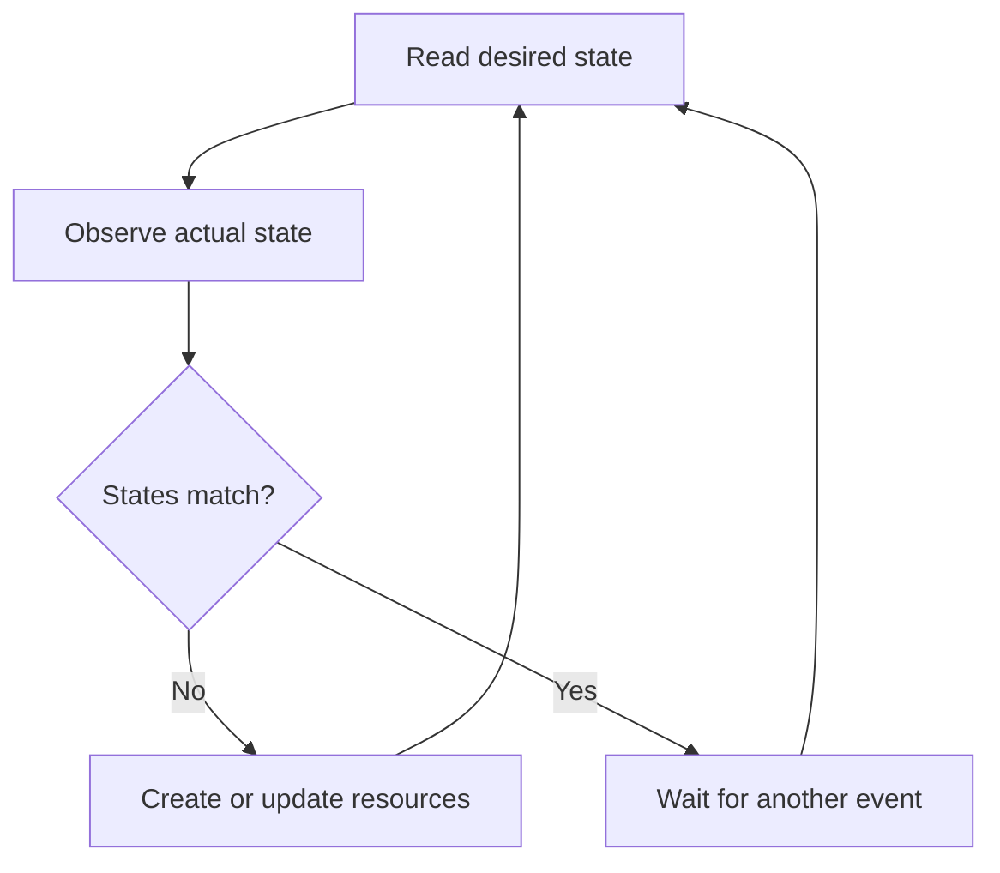

# Chapter 1: Project Setup and Operator Foundations

## Learning objectives

After this chapter, you should be able to explain:

- What a Kubernetes operator is
- What a control loop does
- Desired state versus actual state
- Why Kubebuilder was selected
- How the project was initialized
- What the generated directories contain
- Which files are generated and which files we own
- Basic Go concepts used by the project

## 1. What is a Kubernetes operator?

A Kubernetes operator is an application-specific Kubernetes controller.

A normal Kubernetes controller manages built-in resources. For example:

- Deployment controller manages Deployments and ReplicaSets
- Job controller manages Jobs and Pods
- Node controller monitors Nodes

An operator extends Kubernetes so that it can manage a new type of resource and its operational lifecycle.

Our operator introduces this new resource:

```yaml
apiVersion: apps.fixnops.com/v1alpha1
kind: PlatformApp
```

A PlatformApp represents the desired state of an application. The operator converts that desired state into a Deployment and Service.

## 2. Desired state and actual state

Kubernetes follows a declarative model.

The user declares what should exist:

```yaml
spec:
  image: nginx:1.27
  replicas: 2
  port: 80
```

This is the desired state.

The cluster may currently contain:

- No Deployment
- A Deployment with the wrong image
- A Deployment with the wrong replica count
- No Service
- A Service using the wrong port

This is the actual state.

The operator repeatedly compares the desired state with the actual state and moves the actual state toward the desired state.



This repeating process is called reconciliation.

## 3. The control loop

The controller-runtime library calls our `Reconcile()` method when a relevant event occurs.

Examples of events include:

- A PlatformApp is created
- A PlatformApp spec is updated
- An owned Deployment changes
- An owned Service changes
- A managed resource is deleted
- A previous reconciliation returned an error and must be retried

The controller must not assume that it will run only once. The same resource may be reconciled many times.

For this reason, reconciliation must be idempotent.

Idempotent means that running the same reconciliation repeatedly against an already-correct system produces the same final state without unnecessary changes.

## 4. Controller versus operator

The terms are related but not identical.

A controller is the control-loop implementation that watches resources and reconciles state.

An operator normally contains:

- One or more controllers
- Custom Resource Definitions
- Custom API types
- RBAC
- Deployment manifests
- Health and metrics endpoints
- Upgrade and operational logic

Our `PlatformAppReconciler` is the controller. The complete project is the PlatformApp Operator.

## 5. Why Kubebuilder?

Writing an operator manually requires substantial Kubernetes API boilerplate.

Kubebuilder provides:

- Standard Go project layout
- API and controller scaffolding
- controller-runtime integration
- CRD generation
- Deep-copy generation
- RBAC generation
- Kustomize manifests
- Test environment scaffolding
- Dockerfile and Makefile targets

Kubebuilder does not write our business logic. It creates the structure into which we add the desired API and reconciliation behavior.

## 6. Project identity

The project uses the following identity:

| Property | Value |
|---|---|
| Project name | `platformapp-operator` |
| Go module | `github.com/fixnops/platformapp-operator` |
| API domain | `fixnops.com` |
| API group | `apps.fixnops.com` |
| API version | `v1alpha1` |
| Kind | `PlatformApp` |
| Scope | Namespaced |

These values serve different purposes.

### Project name

The project name identifies the operator and contributes to generated Kubernetes resource names.

```text
platformapp-operator
```

### Go module

The Go module is the import path used by Go packages inside the project:

```text
github.com/fixnops/platformapp-operator
```

For example:

```go
import appsv1alpha1 "github.com/fixnops/platformapp-operator/api/v1alpha1"
```

### Domain and API group

Kubebuilder combines the API group with the domain.

Group:

```text
apps
```

Domain:

```text
fixnops.com
```

Result:

```text
apps.fixnops.com
```

The full API version becomes:

```text
apps.fixnops.com/v1alpha1
```

## 7. Repository initialization

The Git repository was cloned from:

```text
https://github.com/fixnops/platformapp-operator.git
```

The final Kubebuilder initialization command was:

```bash
kubebuilder init \
  --domain fixnops.com \
  --repo github.com/fixnops/platformapp-operator \
  --project-name platformapp-operator \
  --plugins=go/v4
```

The arguments mean:

| Argument | Purpose |
|---|---|
| `--domain fixnops.com` | Sets the API domain |
| `--repo ...` | Sets the Go module path |
| `--project-name ...` | Sets the generated project name |
| `--plugins=go/v4` | Uses the Kubebuilder Go v4 project layout |

Kubebuilder records these decisions in `PROJECT`.

Relevant final values:

```yaml
domain: fixnops.com
projectName: platformapp-operator
repo: github.com/fixnops/platformapp-operator
```

## 8. Go module

The `go.mod` file defines:

- The module import path
- The Go language version
- Direct dependencies
- Indirect dependencies

The module declaration is:

```go
module github.com/fixnops/platformapp-operator
```

The project declares Go 1.26 compatibility, while it was developed locally using Go 1.27.1.

Important dependencies include:

- `k8s.io/api`
- `k8s.io/apimachinery`
- `k8s.io/client-go`
- `sigs.k8s.io/controller-runtime`
- Ginkgo
- Gomega

`controller-runtime` provides the manager, Kubernetes client, reconciliation interfaces, cache, event watches, logging, leader election, health checks, and metrics integration.

## 9. Generated project structure

The important initial structure was:

```text
.
├── cmd/
│   └── main.go
├── config/
│   ├── default/
│   ├── manager/
│   ├── rbac/
│   └── samples/
├── hack/
│   └── boilerplate.go.txt
├── test/
├── Dockerfile
├── Makefile
├── PROJECT
├── README.md
├── go.mod
└── go.sum
```

After creating the API, Kubebuilder also generated:

```text
api/v1alpha1/
internal/controller/
config/crd/
```

## 10. Purpose of important files

### `PROJECT`

Contains Kubebuilder metadata. Kubebuilder uses it to understand the project layout and enabled APIs.

### `go.mod` and `go.sum`

`go.mod` describes dependencies and module identity.

`go.sum` stores checksums used to verify downloaded dependency content.

### `cmd/main.go`

This is the program entry point. It:

- Creates the runtime scheme
- Registers Kubernetes and custom API types
- Creates the controller manager
- Configures metrics
- Configures health probes
- Configures leader election
- Registers the PlatformApp controller
- Starts the manager

### `Makefile`

Provides repeatable development commands such as:

```bash
make manifests
make generate
make fmt
make test
make build
make docker-build
make deploy
```

### `Dockerfile`

Builds the Go manager binary and packages it into a minimal non-root runtime image.

### `config/`

Contains Kustomize-based Kubernetes manifests for:

- CRDs
- RBAC
- Manager Deployment
- Metrics
- Samples
- Top-level installation

## 11. Generated versus developer-owned files

Understanding ownership prevents accidental changes to generated artifacts.

### Developer-owned files

We intentionally maintain:

- `api/v1alpha1/platformapp_types.go`
- `internal/controller/platformapp_controller.go`
- `internal/controller/platformapp_controller_test.go`
- `config/samples/`
- Deployment customizations
- Documentation

### Generated files

Tools maintain:

- `api/v1alpha1/zz_generated.deepcopy.go`
- `config/crd/bases/apps.fixnops.com_platformapps.yaml`
- `config/rbac/role.yaml`

Generated files should normally be changed by editing their source definitions or markers and then running generation commands.

For example:

```bash
make manifests
make generate
```

## 12. Basic Go concepts used in the project

You do not need to master all of Go before developing an operator. Start with the concepts used by the controller.

### Packages

Every Go file belongs to a package:

```go
package controller
```

Files in the same directory commonly belong to the same package and can use each other's exported and unexported identifiers.

### Imports

Imports allow one package to use another:

```go
import (
    "context"

    appsv1 "k8s.io/api/apps/v1"
    ctrl "sigs.k8s.io/controller-runtime"
)
```

Aliases such as `appsv1` and `ctrl` make package references clear and avoid naming conflicts.

### Structs

A struct groups related data:

```go
type PlatformAppReconciler struct {
    client.Client
    Scheme *runtime.Scheme
}
```

The reconciler contains:

- A Kubernetes API client
- A runtime scheme describing known API types

### Methods

A method is a function associated with a type:

```go
func (r *PlatformAppReconciler) Reconcile(
    ctx context.Context,
    req ctrl.Request,
) (ctrl.Result, error)
```

The receiver:

```go
r *PlatformAppReconciler
```

allows the method to use the reconciler's client and scheme.

### Pointers

A pointer refers to an existing value:

```go
*PlatformAppReconciler
```

Pointers are commonly used for Kubernetes objects because reconciliation reads and modifies structured objects.

### Context

`context.Context` carries cancellation, deadlines, tracing, and request-scoped information.

The controller passes it to Kubernetes API operations:

```go
r.Get(ctx, req.NamespacedName, platformApp)
```

### Error handling

Go returns errors as values:

```go
if err != nil {
    return ctrl.Result{}, err
}
```

Returning an error from `Reconcile()` tells controller-runtime that reconciliation failed and should be retried.

### Interfaces

`client.Client` is an interface. It defines Kubernetes operations such as:

- `Get`
- `List`
- `Create`
- `Update`
- `Patch`
- `Delete`

Using an interface makes the controller easier to test.

## 13. Initial validation

The generated manager was compiled using:

```bash
make build
```

This performs generation, formatting, static analysis, and compilation.

The resulting local binary was:

```text
bin/manager
```

On the development Mac, it was a Darwin ARM64 executable. Later, the Docker build produced a Linux ARM64 binary for the Kubernetes nodes.

Health endpoints were initially tested using:

```bash
curl -i http://localhost:8081/healthz
curl -i http://localhost:8081/readyz
```

Both returned HTTP `200 OK`.

At this initial stage, the manager could run, but it did not yet manage an application because the custom API and reconciliation logic had not been implemented.

## 14. Common beginner mistakes

### Confusing project name and Go module

The project name identifies generated Kubernetes components. The Go module is the package import path.

They may be related, but they are not interchangeable.

### Running `kubebuilder init` twice

Kubebuilder refuses to initialize a directory that already contains an initialized project.

Inspect `PROJECT` before attempting initialization again.

### Editing generated CRD YAML directly

Changes can be overwritten during the next `make manifests`.

Edit API types and Kubebuilder markers instead.

### Assuming the controller runs only once

Reconciliation is event-driven and may execute many times. Logic must be idempotent.

### Running local and in-cluster controllers together

Two controllers without shared leader-election configuration may process the same resources.

Stop or scale down one environment before starting the other.

## 15. Interview questions and answers

### What is a Kubernetes operator?

A Kubernetes operator is an application-specific controller that extends the Kubernetes API and continuously reconciles custom resources with actual cluster or external state.

### What is reconciliation?

Reconciliation is the process of reading desired state, observing actual state, and making changes that move actual state toward desired state.

### What is idempotency?

Idempotency means repeated execution with the same desired and actual state produces the same result without unnecessary changes.

### Why use Kubebuilder?

Kubebuilder generates the standard project structure and Kubernetes integration needed for Go-based operators, including API scaffolding, controllers, CRDs, RBAC, tests, Docker packaging, and Kustomize manifests.

### What does controller-runtime provide?

It provides the manager, cached Kubernetes client, event watches, reconciliation framework, logging, metrics, health checks, and leader election.

### What is the difference between `spec` and `status`?

`spec` is the user's desired state. `status` is the controller's observation of the current state.

### Why is the API group `apps.fixnops.com`?

The project uses group `apps` and domain `fixnops.com`. Kubebuilder combines them to create the fully qualified API group.

## 16. Chapter summary

The project foundation established:

- A Go module
- A Kubebuilder v4 project
- The `fixnops.com` API domain
- Standard controller-runtime manager scaffolding
- Kubernetes manifests and build automation
- A structure for adding the PlatformApp API and controller

The next chapter explains how the PlatformApp API, CRD schema, validation, defaults, and generated Kubernetes resources were created.